# lab2 实验报告
PB20000277 孙昊哲

## 问题1: getelementptr
请给出 `IR.md` 中提到的两种 getelementptr 用法的区别,并稍加解释:
  - `%2 = getelementptr [10 x i32], [10 x i32]* %1, i32 0, i32 %0`
  - `%2 = getelementptr i32, i32* %1 i32 %0`

  -------

第一种用法中，`[10 x i32]*`是指向数组指针的指针，

第二种用法中，`i32*`是指向32位int类型的指针。

也就是说第一种用法的含义是，先取出数组指针`%1`，`%1`指向的数组元素类型是`[10 x i32]`,取出数组下标为`0`的项(`[10 x i32]`),然后从这个数组中取出第`%0`个元素，

第二种用法的含义是，`%1`指向的是元素类型为`i32`类型的数组，取出第`%0`个元素。

  -----------

## 问题2: cpp 与 .ll 的对应
请说明你的 cpp 代码片段和 .ll 的每个 BasicBlock 的对应关系。

---------

在`.cpp`文件中，每个`BasicBlock`使用`BasicBlock::create()`函数创建，并且每个`BasicBlock`都有一个`label`。

`.ll`文件中的每一个`label`值都与`.cpp`文件中的`BasicBlock`的`label`值一一对应。

在`.ll` 跳转语句`br`当中，`br`接受参数`label`，同样地，在`cpp`文件当中，`build->create_cond_br()/build->cread_br()`接受`BasicBlock`对象为参数，其效果一致。

* `assign`
  
  在`.cpp`文件当中，使用`auto bb = BasicBlock::create(module, "entry", mainFun);`定义基本块，在`.ll`对应生成相应的`BasicBlock`，直到程序结束;

* `fun`

  在`.cpp`文件中两个函数各拥有一个基本块，对应地，在`.ll`文件中也有两个`BasicBlock`;

* `if`

  在`.cpp`文件中定义了三个BasicBlock，分别为`entry`, `trueBB`, `falseBB`, 与之对应地，在.ll文件中也有三个BasicBlock，分别为，`label_entry`, `label_trueBB`, `label_falseBB`;

  他们的作用分别是：`entry`用于函数开始入口，`trueBB`用于执行`if`语句块，`falseBB`用于执行`else`语句块;

* `while`

  一共有四个基本块，分别为`entry`, `loopBB`, `trueBB`, `falseBB`, 对应地，在`.ll`文件中也有四个`BasicBlock`, 分别为`label_entry`, `label_loopBB`, `label_trueBB`, `label_falseBB`;

  他们分别表示，`main`函数开始的基本块，循环体的基本块，循环条件为真时的基本块，循环条件为假时的基本块。

  -----------

## 问题3: Visitor Pattern
分析 `calc` 程序在输入为 `4 * (8 + 4 - 1) / 2` 时的行为：
1. 请画出该表达式对应的抽象语法树（使用 `calc_ast.hpp` 中的 `CalcAST*` 类型和在该类型中存储的值来表示），并给节点使用数字编号。

  
  
2. 请指出示例代码在用访问者模式遍历该语法树时的遍历顺序。

序列请按如下格式指明（序号为问题 2.1 中的编号）：  
3->2->5->1

 ```
   0->
   1->
   2->
   	3->
   		5->
   			7->
   		6->
   			8->
   				10->
   					13->
   						15->
   				11->
   					14->
   			9->
   				12->
   	4
   ```

## 实验难点
实验文档较多，阅读起来比较困难，但是对着实验文档一步步做下来，还是能够完成的。

## 实验反馈
希望助教能够提供比较翔实的参考链接，供同学们参考
